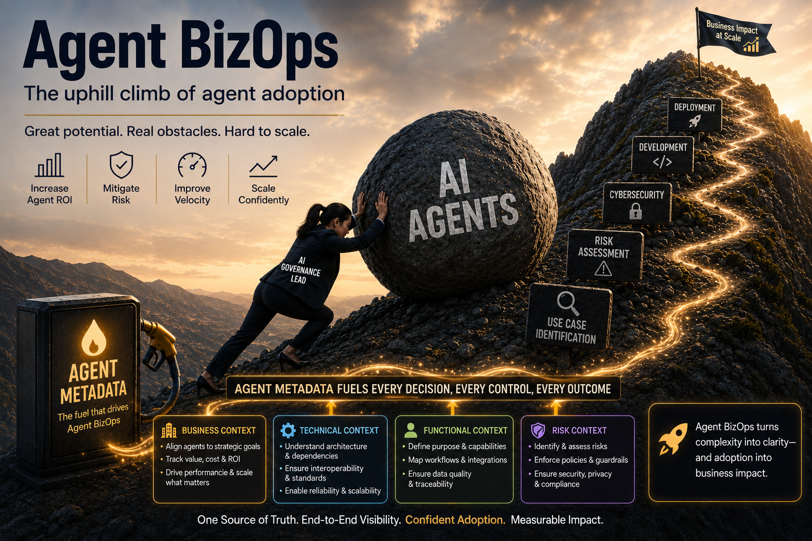

## What is Tavro?

  

Enterprise adoption of AI Agents is a huge challenge.

Tavro is an **Agent BizOps** Platform to agentify agent adoption including initial risk assessment, what-if analysis, and integration with agent development. Tavro offers a three-layer architecture that ensures every AI agent in your organization carries the business, regulatory, and risk context it needs to operate safely and compliantly.

---

## Platform Architecture

### 🔵 Open Standard — Agent BizOps Powered by Agent Metadata Specification (AMS)

Defines how agents describe themselves: risk profile, business context, technical footprint, and regulatory obligations. The universal language for AI agent governance.

### 🟡 Open Source — Tavro Agent BizOps

Open-source local environment for exploring Tavro's Agent BizOps platform. Spin up the full stack with one Docker command and connect it to Claude and ChatGPT via MCP Server.

### 🟠 Enterprise SaaS — Tavro Platform

The full governance suite for regulated enterprises:

- Auto-generate AI Use Cases
- Auto-generate AI Agent Prototypes
- Automated risk scoring for AI Agents
- Deep integrations with ServiceNow and Microsoft Copilot
- Sample AI Use Cases and Integrations
---

We believe open standards are the foundation of trustworthy AI. Contributions, issues, and RFCs are welcome.

---

## Get Involved

| | |
|---|---|
| 🌐 Website | [tavro.ai](https://tavro.ai) |
| 📬 Contact | [info@tavro.ai](mailto:info@tavro.ai) |
| 🔗 LinkedIn | [linkedin.com/company/tavro-ai](https://linkedin.com/company/tavro-ai) |

---

  Tavro AI · Agent BizOps · 

